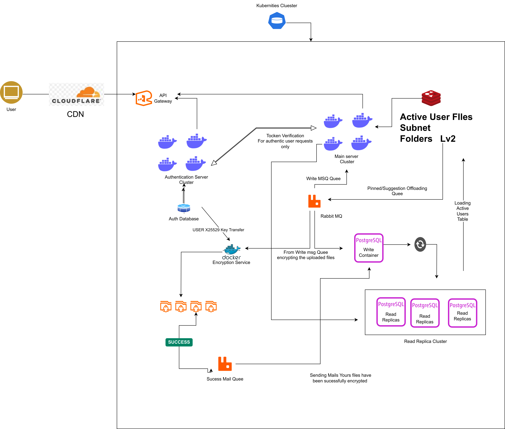

# 🔐 Encrypt5 Microservices Architecture



A secure, scalable microservices architecture for file encryption and management built with modern cloud-native technologies. This system provides end-to-end encryption services through a distributed architecture with containerized services and Kubernetes orchestration.

## 🏗️ Architecture Overview

```
┌─────────────────┐    ┌──────────────────┐    ┌─────────────────┐
│   Frontend      │────│    Gateway       │────│   Auth Service  │
│   (React+Vite)  │    │   (API Gateway)  │    │   (Flask+JWT)   │
└─────────────────┘    └──────────────────┘    └─────────────────┘
                                │                         │
                                ▼                         ▼
┌─────────────────┐    ┌──────────────────┐    ┌─────────────────┐
│   Notification  │    │   RabbitMQ       │    │   PostgreSQL    │
│   Service       │────│   (Message Bus)  │────│   Database      │
└─────────────────┘    └──────────────────┘    └─────────────────┘
                                │
                                ▼
┌─────────────────┐    ┌──────────────────┐
│   Encryptor     │────│   Redis Cache    │
│   Service       │    │   Service        │
└─────────────────┘    └──────────────────┘
```

## 🚀 Services

### Frontend (`/frontend`)
- **Technology**: React 18 + Vite + TailwindCSS
- **Features**: Modern SPA with file upload interface
- **Purpose**: User interface for file encryption/decryption operations
- **Port**: 3000

### Backend Services (`/backend/src`)

#### 🔑 Authentication Service (`/auth`)
- **Technology**: Flask + JWT + PostgreSQL
- **Features**: User authentication, token validation, session management
- **Database**: PostgreSQL with user credentials
- **Port**: 5000

#### 🌐 API Gateway (`/gateway`)
- **Technology**: Flask + RabbitMQ integration
- **Features**: Request routing, authentication middleware, file upload handling
- **Storage**: Local file system with structured organization
- **Max File Size**: 2GB
- **Supported Formats**: PNG, JPG, JPEG, GIF, PDF, ZIP

#### 🔒 Encryptor Service (`/encryptor`)
- **Technology**: Python + RabbitMQ Consumer
- **Features**: File encryption/decryption processing
- **Queue**: Asynchronous job processing via message queues

#### 📧 Notification Service (`/notification`)
- **Technology**: Python + Email integration
- **Features**: Email notifications for completed operations
- **Queue**: Event-driven notifications via RabbitMQ

#### 📦 Redis Cache Service (`/reddis`)
- **Technology**: Python + Redis
- **Features**: Caching layer for improved performance
- **Purpose**: Session storage and temporary data caching

#### 🐰 Message Queue (`/rabbit`)
- **Technology**: RabbitMQ
- **Features**: Asynchronous message passing between services
- **Purpose**: Decoupled service communication

## 🛠️ Technology Stack

| Component | Technology | Version |
|-----------|------------|---------|
| Frontend | React | 18.3.1 |
| Build Tool | Vite | 5.4.8 |
| Styling | TailwindCSS | 3.4.14 |
| Backend | Flask | Latest |
| Database | PostgreSQL | Latest |
| Cache | Redis | Latest |
| Message Queue | RabbitMQ | Latest |
| Container | Docker | Latest |
| Orchestration | Kubernetes | Latest |

## 🚀 Quick Start

### Prerequisites
- Docker & Docker Compose
- Kubernetes cluster (minikube/kind for local development)
- Node.js 18+ (for frontend development)
- Python 3.9+ (for backend development)

### 1. Clone the Repository
```bash
git clone <repository-url>
cd Encrypt5_Microservices_Structure
```

### 2. Environment Setup
```bash
# Backend services
cd backend/src/auth && cp .env.example .env
cd ../gateway && cp .env.example .env
# Configure your database credentials and API keys
```

### 3. Build and Deploy
```bash
# Build all Docker images
docker-compose build

# Deploy to Kubernetes
kubectl apply -f backend/src/*/manifests/
```

### 4. Frontend Development
```bash
cd frontend
npm install
npm run dev
```

## 🔧 Configuration

### Environment Variables
Each service requires specific environment variables:

#### Authentication Service
```env
DB_NAME=encryptiv_db
DB_USER=your_username
DB_PASSWORD=your_password
DB_HOST=postgres
JWT_SECRET=your_jwt_secret
```

#### Gateway Service
```env
RABBITMQ_HOST=rabbitmq
RABBITMQ_PORT=5672
UPLOAD_FOLDER=/var/lib/upload/
MAX_CONTENT_LENGTH=2147483648
```

### Kubernetes Configuration
- **ConfigMaps**: Environment-specific configurations
- **Secrets**: Sensitive data like passwords and API keys
- **Services**: Internal service discovery and load balancing
- **Ingress**: External traffic routing

## 📊 Service Communication

1. **Frontend** → **Gateway**: REST API calls for file operations
2. **Gateway** → **Auth**: JWT token validation
3. **Gateway** → **RabbitMQ**: Job queue publishing
4. **RabbitMQ** → **Encryptor**: File processing jobs
5. **RabbitMQ** → **Notification**: Email notification triggers
6. **Services** → **Redis**: Caching and session storage
7. **Auth/Gateway** → **PostgreSQL**: User data and metadata

## 🔐 Security Features

- **JWT Authentication**: Secure token-based authentication
- **File Encryption**: End-to-end file encryption at rest
- **Input Validation**: Secure file upload with type validation
- **Environment Isolation**: Containerized services with minimal attack surface
- **Secret Management**: Kubernetes secrets for sensitive configuration

## 📈 Scalability & Performance

- **Horizontal Scaling**: Kubernetes-native scaling for all services
- **Async Processing**: Non-blocking file operations via message queues
- **Caching Layer**: Redis for improved response times
- **Load Balancing**: Built-in Kubernetes service load balancing
- **Resource Limits**: Configured resource constraints for optimal performance

## 🧪 Development

### Local Development Setup
```bash
# Start infrastructure services
docker-compose up -d postgres rabbitmq redis

# Run individual services
cd backend/src/auth && python server.py
cd backend/src/gateway && python server.py
cd backend/src/encryptor && python consumer.py

# Frontend development
cd frontend && npm run dev
```

### Testing
```bash
# Backend testing
cd backend && python -m pytest

# Frontend testing
cd frontend && npm test
```

## 📁 Project Structure

```
Encrypt5_Microservices_Structure/
├── README.md
├── LICENSE
├── Encrypt5.png
├── docs/
│   └── encryptiv_db_dump.sql
├── frontend/
│   ├── src/
│   ├── public/
│   ├── package.json
│   └── Dockerfile
└── backend/
    └── src/
        ├── auth/
        ├── gateway/
        ├── encryptor/
        ├── notification/
        ├── reddis/
        └── rabbit/
```

## 🤝 Contributing

1. Fork the repository
2. Create a feature branch
3. Make your changes
4. Add tests for new functionality
5. Submit a pull request

## 📄 License

This project is licensed under the Apache License 2.0 - see the [LICENSE](LICENSE) file for details.

## 🔍 Monitoring & Observability

- **Health Checks**: Built-in health endpoints for all services
- **Logging**: Centralized logging with structured formats
- **Metrics**: Prometheus-compatible metrics endpoints
- **Tracing**: Distributed tracing support

## 🚨 Production Considerations

- **SSL/TLS**: Enable HTTPS for all external communications
- **Rate Limiting**: Implement API rate limiting
- **Backup Strategy**: Regular database and file storage backups
- **Monitoring**: Set up comprehensive monitoring and alerting
- **Security Scanning**: Regular container and dependency vulnerability scans

---

**Built with ❤️ for secure file management and encryption services**